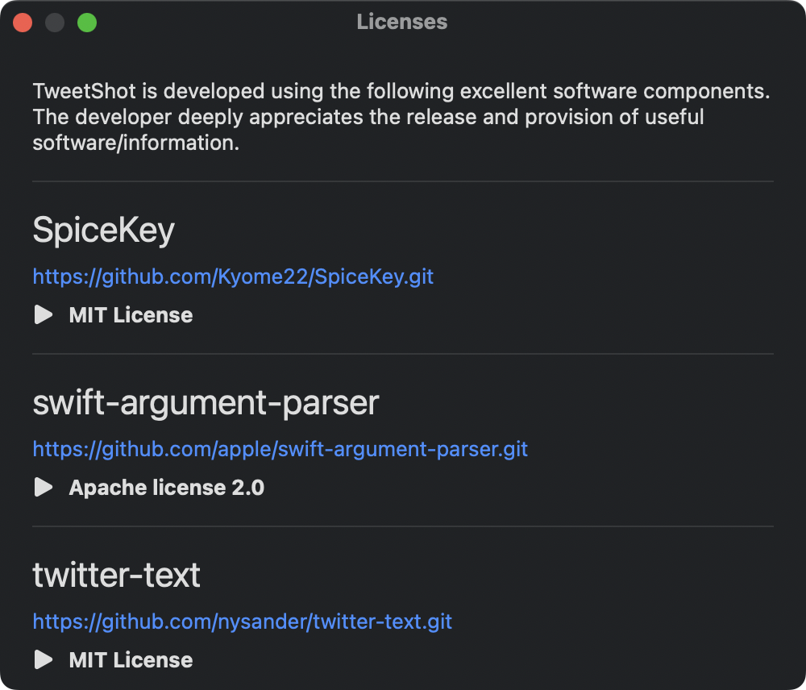
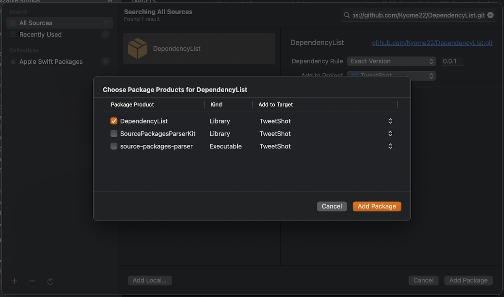
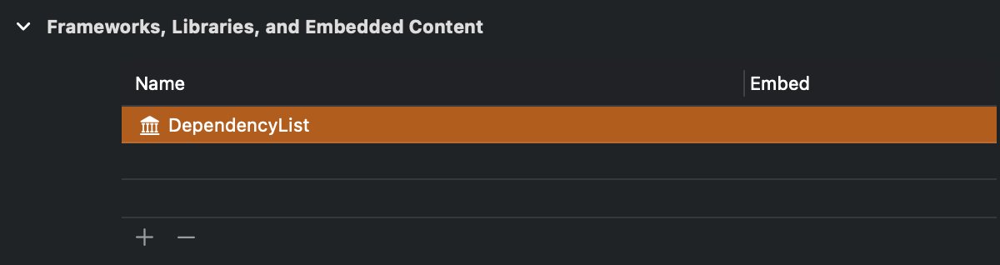

# DependencyList

Generate a list of dependencies for the swift package libraries that your macOS app depends on.

[](https://github.com/Kyome22/DependencyList/issues)
[](https://github.com/Kyome22/DependencyList/network/members)
[](https://github.com/Kyome22/DependencyList/stargazers)
[](https://github.com/Kyome22/DependencyList/)
[](https://github.com/Kyome22/DependencyList/releases)
[](https://github.com/Kyome22/DependencyList/)

**Example**



## Supported License Types

- Apache license 2.0
- MIT License
- BSD 3-clause Clear license
- zLib License

## Requirements

- Written in Swift 5
- Compatible with macOS 12.0+
- Development with Xcode 15.2+

## Privacy Manifest

This library does not collect or track user information, so it does not include a PrivacyInfo.xcprivacy file.

## Installation

DependencyList is available through [Swift Package Manager](https://github.com/apple/swift-package-manager/).

1. Integrate DependencyList in your project
   - File > Add Packages...
   - Search `https://github.com/Kyome22/DependencyList.git`
   - Choose `DependencyList` product and add it to your application target  
     
2. Link DependencyList in your application target
   - Application Target > `General` > `Frameworks, Libraries, and Embedded Content` > `+`
   - Choose `DependencyList`  
     

## Usage

Use `DependencyListWindow`.

```swift
import AppKit
import DependencyList

let window = DependencyListWindow()
let licensesWindowColtroller = NSWindowController(window: window)
licensesWindowColtroller?.showWindow(nil)
```
